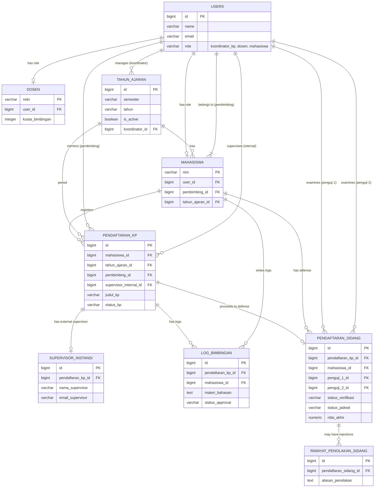

# Dokumentasi Database & Schema

Dokumen ini menjelaskan struktur relasional database yang digunakan oleh **Sistem Informasi Sidang KP**.

## Entity Relationship Diagram (ERD)

Berikut adalah diagram relasi antar tabel (ERD) utama dalam aplikasi:

---

## Deskripsi Tabel Utama

### 1. Akun & Profil (`users`, `mahasiswa`, `dosen`)
- **`users`**: Tabel master untuk autentikasi. Semua pengguna (Koordinator, Dosen, Mahasiswa) memiliki 1 *row* di sini. Disambungkan dengan tabel turunan berdasarkan kolom `role`.
- **`mahasiswa`**: Tabel profil spesifik mahasiswa. Primary key adalah `nim`. Tersambung ke tabel `users` (sebagai dirinya sendiri) dan `users` (sebagai `pembimbing_id` dosen).
- **`dosen`**: Tabel profil spesifik dosen. Menyimpan `nidn` dan informasi administratif seperti `kuota_bimbingan`.

### 2. Akademik (`tahun_ajaran`, `timeline_kegiatan`)
- **`tahun_ajaran`**: Mengatur periode aktif pelaksanaan KP (misal: "Ganjil 2026/2027"). Seluruh data pendaftaran terkait dengan 1 periode spesifik.
- **`timeline_kegiatan`**: Jadwal dan *deadline* (tenggat waktu) untuk aktivitas penting per `tahun_ajaran` (contoh: batas akhir daftar sidang).

### 3. Eksekusi KP (`pendaftaran_kp`, `supervisor_instansi`, `log_bimbingan`)
- **`pendaftaran_kp`**: Jantung dari proses praktek. Menyimpan informasi mahasiswa KP di perusahaan mana, posisinya apa, siapa dosen pembimbingnya, dan siapa dosen supervisor internalnya (jika ada).
- **`supervisor_instansi`**: Menyimpan data supervisor dari pihak eksternal (perusahaan/instansi tempat KP). Data email ini digunakan untuk mengirimkan link form penilaian.
- **`log_bimbingan`**: Catatan aktivitas bimbingan/konsultasi mahasiswa. Mengandung lampiran file progress dan status *approval* (disetujui/ditolak oleh dosen).

### 4. Evaluasi Akhir (`pendaftaran_sidang`, `riwayat_penolakan_sidang`)
- **`pendaftaran_sidang`**: Sentral dari proses sidang akhir. Tabel ini yang tergemuk karena menyimpan:
  - Berkas syarat sidang (laporan, log, persetujuan).
  - Waktu dan ruang eksekusi sidang.
  - Relasi ke Penguji 1 & Penguji 2.
  - **Seluruh komponen nilai** (nilai pembimbing, nilai penguji, nilai supervisor, hingga hasil komputasi *nilai akhir* dan *grade* huruf).
  - Status pengerjaan revisi pasca-sidang.
- **`riwayat_penolakan_sidang`**: Jika syarat sidang ditolak oleh Koordinator (misal: berkas buram), log alasan penolakannya disimpan di sini untuk bahan evaluasi mahasiswa.

### 5. Log & Sistem (`audit_logs`, `notifikasi_logs`, `backup_histories`)
- **`notifikasi_logs`**: Menyimpan pesan pemberitahuan dalam aplikasi dari satu entitas ke entitas lain (misalnya: Koordinator mengirim jadwal ke Mahasiswa).
- **`audit_logs`**: Merekam jejak sistem secara teknis (URL, aksi, IP Address, HTTP Method) untuk keamanan (*security traceback*).
- **`backup_histories`**: Mencatat *snapshot* backup database periodik yang ditarik oleh Koordinator.

---

## Pemetaan Lengkap Foreign Key (FK)

Tabel berikut adalah referensi seluruh FK berdasarkan constraint `ALTER TABLE` yang ada di skema database. Perhatikan bahwa beberapa nama field tidak mencerminkan nama tabel tujuannya secara langsung (karena satu tabel `users` dipakai untuk semua role).

### Tabel `audit_logs`
| Field (FK) | Merujuk ke Tabel | Merujuk ke Kolom | Aksi jika dihapus |
|---|---|---|---|
| `user_id` | `users` | `id` | SET NULL |

### Tabel `backup_histories`
| Field (FK) | Merujuk ke Tabel | Merujuk ke Kolom | Aksi jika dihapus |
|---|---|---|---|
| `koordinator_id` | `users` | `id` | SET NULL |
| `tahun_ajaran_id` | `tahun_ajaran` | `id` | SET NULL |

### Tabel `dosen`
| Field (FK) | Merujuk ke Tabel | Merujuk ke Kolom | Aksi jika dihapus |
|---|---|---|---|
| `user_id` | `users` | `id` | CASCADE |

### Tabel `log_bimbingan`
| Field (FK) | Merujuk ke Tabel | Merujuk ke Kolom | Aksi jika dihapus |
|---|---|---|---|
| `mahasiswa_id` | `users` | `id` | CASCADE |
| `pendaftaran_kp_id` | `pendaftaran_kp` | `id` | CASCADE |

### Tabel `mahasiswa`
| Field (FK) | Merujuk ke Tabel | Merujuk ke Kolom | Aksi jika dihapus |
|---|---|---|---|
| `user_id` | `users` | `id` | CASCADE |
| `pembimbing_id` | `users` | `id` | SET NULL |

> **Catatan:** `pembimbing_id` di tabel `mahasiswa` merujuk ke `users.id` (bukan ke tabel `dosen`), karena dosen disimpan di tabel `users` dengan role `dosen`.

### Tabel `notifikasi_logs`
| Field (FK) | Merujuk ke Tabel | Merujuk ke Kolom | Aksi jika dihapus |
|---|---|---|---|
| `sender_id` | `users` | `id` | SET NULL |
| `receiver_id` | `users` | `id` | SET NULL |
| `periode_id` | `tahun_ajaran` | `id` | SET NULL |

### Tabel `pendaftaran_kp`
| Field (FK) | Merujuk ke Tabel | Merujuk ke Kolom | Aksi jika dihapus |
|---|---|---|---|
| `mahasiswa_id` | `users` | `id` | CASCADE |
| `tahun_ajaran_id` | `tahun_ajaran` | `id` | CASCADE |
| `pembimbing_id` | `users` | `id` | SET NULL |
| `supervisor_internal_id` | `users` | `id` | SET NULL |
| `pendaftaran_asal_id` | `pendaftaran_kp` | `id` | SET NULL (self-referential, untuk data lanjutan) |

### Tabel `pendaftaran_sidang`
| Field (FK) | Merujuk ke Tabel | Merujuk ke Kolom | Aksi jika dihapus |
|---|---|---|---|
| `pendaftaran_kp_id` | `pendaftaran_kp` | `id` | CASCADE |
| `mahasiswa_id` | `users` | `id` | CASCADE |
| `penguji_1_id` | `users` | `id` | SET NULL |
| `penguji_2_id` | `users` | `id` | SET NULL |

### Tabel `riwayat_penolakan_sidang`
| Field (FK) | Merujuk ke Tabel | Merujuk ke Kolom | Aksi jika dihapus |
|---|---|---|---|
| `pendaftaran_sidang_id` | `pendaftaran_sidang` | `id` | CASCADE |

### Tabel `supervisor_instansi`
| Field (FK) | Merujuk ke Tabel | Merujuk ke Kolom | Aksi jika dihapus |
|---|---|---|---|
| `pendaftaran_kp_id` | `pendaftaran_kp` | `id` | CASCADE |

### Tabel `tahun_ajaran`
| Field (FK) | Merujuk ke Tabel | Merujuk ke Kolom | Aksi jika dihapus |
|---|---|---|---|
| `koordinator_id` | `users` | `id` | SET NULL |

### Tabel `timeline_kegiatan`
| Field (FK) | Merujuk ke Tabel | Merujuk ke Kolom | Aksi jika dihapus |
|---|---|---|---|
| `periode_id` | `tahun_ajaran` | `id` | CASCADE |

---

> **Keterangan Aksi FK:**
> - **CASCADE** → Jika data induk dihapus, data turunan ikut dihapus otomatis.
> - **SET NULL** → Jika data induk dihapus, kolom FK di tabel turunan diisi `NULL` (data turunan tetap ada).

